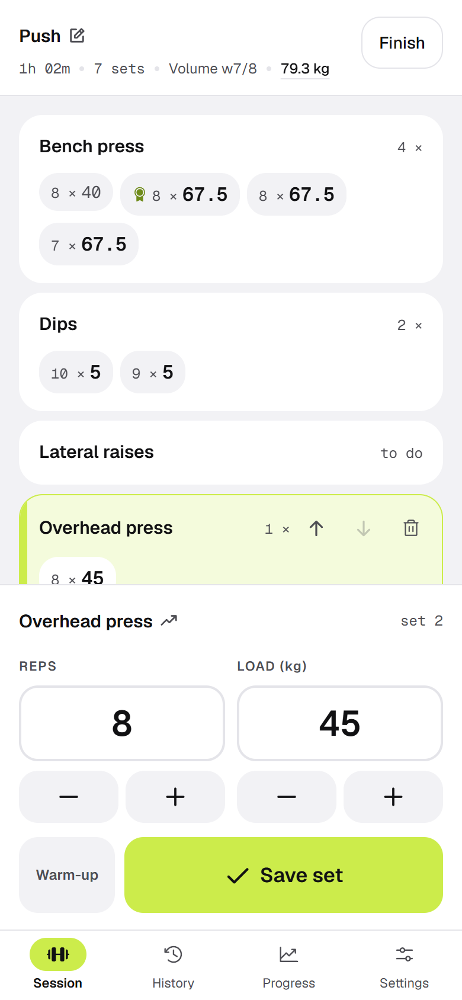
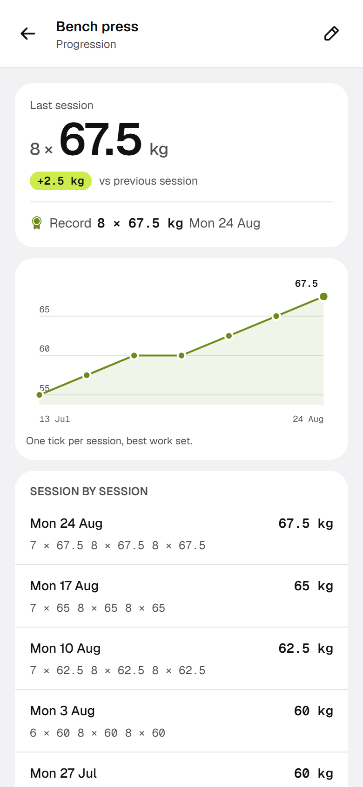
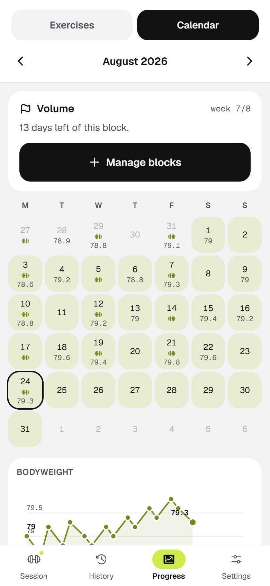
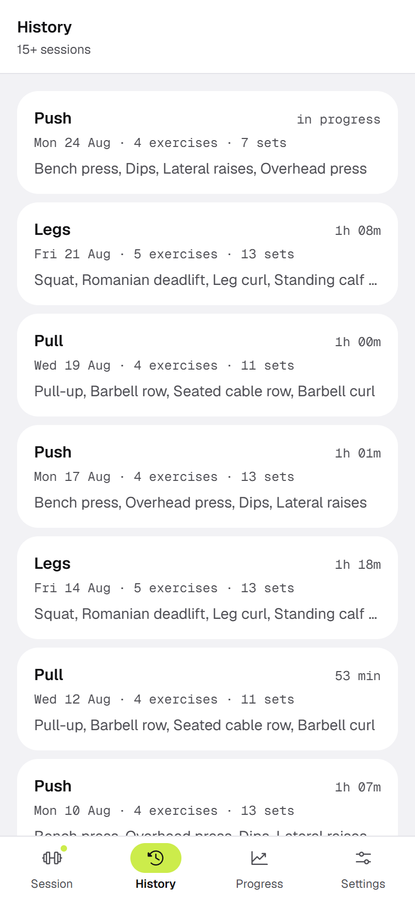
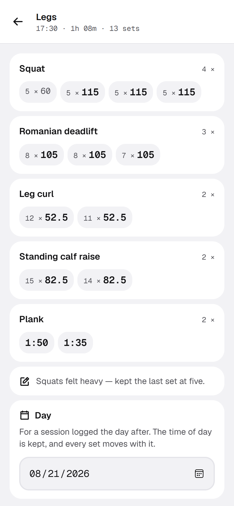
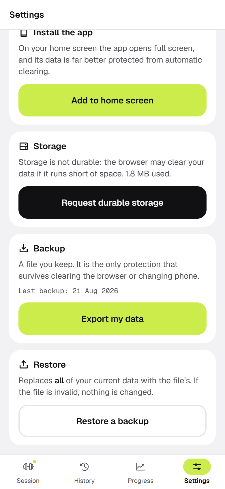

# Workout

A strength-training log. Weights and reps, set by set, so you can see your
progression on a given exercise over time.

Built for how it is actually used: in the gym, phone in one hand, between two
sets. **Logging a set takes two taps** when the exercise is already in the
session, and one to repeat it identically.

All data stays on the device, in IndexedDB. No account, no server, nothing sent
anywhere.

## What it looks like

Six weeks of a push / pull / legs programme, three sessions a week.

| Logging a set | Progression | Calendar |
|:--|:--|:--|
| [](docs/screenshots/session.png) | [](docs/screenshots/progression.png) | [](docs/screenshots/calendar.png) |
| 47 minutes into a push session. The bench is behind — 8 × 67.5 kg twice, then 7 — and the medal sits on the set that holds the record. The panel is already on Overhead press, carrying last session's 8 × 45 kg: **Save set** logs it as is. | Bench press from 55 to 67.5 kg, the fortnight that did not move included. The headline is the last session, the badge its difference with the one before, and the table underneath lists every set — no figure is reachable through the chart alone. | August, week 7 of an eight-week block. A dumbbell marks a day trained, the number below it is that morning's bodyweight, and the tint is the block itself. |

| History | A session, set by set | Backup |
|:--|:--|:--|
| [](docs/screenshots/history.png) | [](docs/screenshots/session-detail.png) | [](docs/screenshots/settings.png) |
| Finished sessions, most recent first, with the one in progress at the top. Every row carries its day, since a programme names its sessions and six weeks of *Push* are otherwise six identical rows. Duration, counts and names come from the session rows and an index count: not one set is read to draw this list. | Legs, 1 h 08: squat 3 × 5 at 115 kg after a warm-up at 60, plank held 1:50 then 1:35. The date can be corrected afterwards — the time of day is kept and every set moves with it. | The export is the whole database as a JSON file. Restoring replaces everything in one transaction: one invalid row and nothing is written. |

## Getting started

```bash
npm install
npm run dev
```

| Command | What it does |
|---|---|
| `npm run dev` | development server |
| `npm test` | test suite (Vitest + fake-indexeddb) |
| `npm run build` | production build |
| `npm run lint` | ESLint |

## Stack

Next.js 16 (App Router) · React 19 · TypeScript · Tailwind v4 · Dexie 4
(IndexedDB) · Vitest.

## Layout

```
app/                routes: session, history, progress, settings
components/         screens and components, by domain
hooks/              Dexie live queries and entry state
lib/db/             model, schema, validation, write layers
lib/                pure logic: formatting, drafts, progression, units
test/               701 tests — *.test.ts logic (Node), *.test.tsx screens (jsdom)
```

## Principles

Three rules carry most of the architecture.

**IndexedDB is the single source of truth.** `useLiveQuery` replays queries
after every write; there is no React-side copy of the data, so nothing to
invalidate or resynchronise.

**Derive rather than validate.** The denormalised fields (`sessionId`,
`exerciseId`, `performedAt`, `order`, `nameKey`) appear in no input type: they
are recomputed from the parent entities. A caller cannot desynchronise them, so
there is nothing to check.

**Two levels of validation, forced by Dexie.** The `creating` / `updating` hooks
are synchronous: they only check what needs no read (types, bounds, enumerations,
consistency between two fields of the same row). Invariants that depend on
another entity — whether a load is expected for a given exercise, an archived
exercise, editing an exercise already in use — live in the transactional layers
of `lib/db/`.

A useful consequence: `setFieldRequirements()` is the single source from which
*both* the validation and the fields shown during entry derive. The screen
cannot produce a set the database would reject.

## Units

Loads are always **stored in kilograms**. Pounds are a display and input
preference, kept in `localStorage`, so switching never rewrites a row. The +/-
steps are native to the unit rather than converted: 2.5 kg becomes 5 lb, the
number printed on the plate, not its literal conversion.

## Offline

A service worker caches the app shell with a **network-first** strategy for
pages: online you always get the latest HTML, so updates stay automatic; the
cache only serves when the network fails. Hashed assets under `/_next/static/`
are cache-first.

A new version never takes over on its own — swapping assets under a loaded page
breaks chunk loading, and mid-session is the worst possible moment. A banner
offers the reload and the user picks when.

## Backup

Data lives in one browser, on one device. Clearing site data erases it for good.

The **Settings** tab exports the whole database as a JSON file and restores it.
Restoring replaces everything and runs in a single transaction: if the file
holds one invalid row, nothing is written and existing data stays intact.

## Licence

MIT. Use it, change it, ship it — keep the copyright notice, and understand it
comes with no warranty of any kind.
